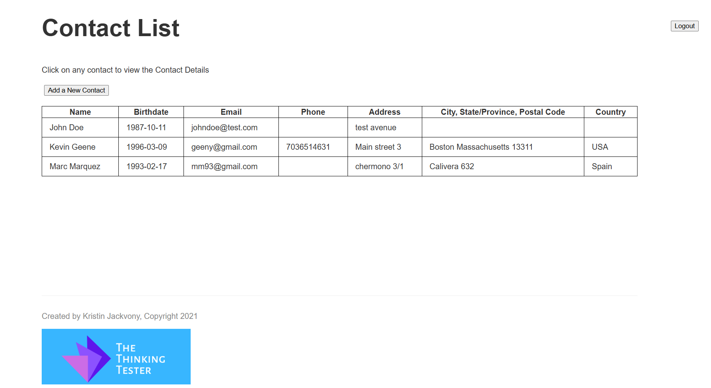

# Contact List App

### [System Under Test (SUT)](https://thinking-tester-contact-list.herokuapp.com)
;

## Overview
This project performs end-to-end **UI, API and Performance** testing for a contact list application (https://thinking-tester-contact-list.herokuapp.com). It uses **Selenium WebDriver** for UI automation **(+ Selenium Grid)** and Rest Assured for **API testing**. 
The framework is built with **Cucumber for BDD** and managed with Maven.


## Built with
**The project utilizes the following technologies and tools:**
* [![Java][Java]][java-url]
* [![Maven][Maven]][maven.url]
* [![Selenium][Selenium]][selenium-url]
* [![CUCUMBER][CUCUMBER]][CUCUMBER-URL]
* [![Rest Assured][Rest Assured]][restassured-url]
* [![Grafana K6][Grafana K6]][Grafana-k6-url]
* [![Selenium Grid][Selenium Grid]][SeleniumGrid-url]
* [![Docker][Docker]][Docker-url]


## Setup Instructions
### Prerequisites
* [![Java][JavaSmall]][java-url]
* [![Maven][MavenSmall]][maven.url]

**Additionally (Optional)**
* [![Grafana K6][Grafana K6Small]][Grafana-k6-url]
* [![Selenium Grid][Selenium GridSmall]][SeleniumGrid-url]
* [![Docker][DockerSmall]][Docker-url]

**Check the versions with the following command:**
```bash
java -version
mvn -version
```
```bash
#for performance tests
k6 version
```

```bash
#Additionally for Selenium Grid
docker -v
```

## Running the Tests
### for UI and API tests:

**Use [Runner](src/test/java/Runner.java)**

**Or**

```bash
# To run all tests
mvn test -Dcucumber
```

### UI tests with Selenium Grid:
```bash
docker compose -f docker-compose.yml up
```

```bash
# Browser is changeable : edge, firefox, chrome
mvn test "-Dbasic_info.browser=chrome" "-Dbasic_info.runMode=grid" "-Dcucumber.filter.tags=@ui"
```
**http://localhost:4444/**

### for performance tests:
* 1st
    ```bash
    cd Performance
    ```
* Then
    ```bash
    k6 run loadTest.js
    ```
    or
    ```bash
    k6 run stressTest.js
    ```

### For API tests check details here: [feature file](src/test/resources/Features/API) and here: [Steps](src/test/java/StepDefinitions/API)
### For Performance tests: [Performance](Performance)
### For UI tests: [feature file](src/test/resources/Features/UI) and here: [Steps](src/test/java/StepDefinitions/UI)


[Java]:https://img.shields.io/badge/Java23-ED8B00?style=for-the-badge&logo=openjdk&logoColor=white
[java-url]:https://www.oracle.com/java/technologies/javase/jdk23-archive-downloads.html
[javaSmall]:https://img.shields.io/badge/JAVA-ED8B00?logo=openjdk&logoColor=white
[Maven]:https://img.shields.io/badge/MAVEN-C71A36?style=for-the-badge&logo=apachemaven&logoColor=white
[maven.url]: https://maven.apache.org/download.cgi
[mavenSmall]:https://img.shields.io/badge/MAVEN-C71A36?logo=apachemaven&logoColor=white
[docker-url]:https://www.docker.com/products/docker-desktop/
[Selenium]: https://img.shields.io/badge/-selenium-CB02A?style=for-the-badge&logo=selenium&logoColor=white
[selenium-url]: https://www.selenium.dev/
[Rest Assured]: https://img.shields.io/badge/-rest%20assured-000000?style=for-the-badge&logo=restassured&logoColor=4CAF50
[restassured-url]:https://rest-assured.io/
[Cucumber]: https://camo.githubusercontent.com/788fbe630f1bafea0c87198f6e3e24e3f03eeef9899248581afc757f11ff5054/68747470733a2f2f696d672e736869656c64732e696f2f62616467652f437563756d6265722d3433423032413f7374796c653d666f722d7468652d6261646765266c6f676f3d637563756d626572266c6f676f436f6c6f723d7768697465
[CUCUMBER-URL]: https://cucumber.io/
[Grafana K6]:https://img.shields.io/badge/GRAFANA%20K6-F46800?style=for-the-badge&logo=grafana&logoColor=white
[Grafana K6Small]:https://img.shields.io/badge/GRAFANA%20K6-7E11F0?logo=k6&logoColor=white
[Grafana-k6-url]:https://grafana.com/docs/k6/latest/set-up/install-k6/
[Selenium Grid]:https://img.shields.io/badge/SELENIUM%20GRID-43B02A?style=for-the-badge&logo=selenium&logoColor=white
[Selenium GridSmall]:https://img.shields.io/badge/SELENIUM%20GRID-43B02A?logo=selenium&logoColor=white
[SeleniumGrid-url]:https://www.selenium.dev/documentation/grid/
[DockerSmall]: https://img.shields.io/badge/DOCKER-2496ED?logo=docker&logoColor=white
[Docker-url]: https://www.docker.com/
[Docker]:https://img.shields.io/badge/DOCKER-2496ED?style=for-the-badge&logo=docker&logoColor=white


